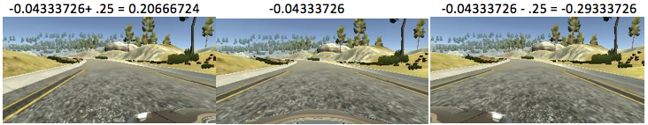

# CarND-Behavioral-Cloning

## Overview
The goal of this project is to train a Convolutional Neural Network (CNN) to map raw pixels from a front-facing camera directly to steering angles. The network learns internal representations of useful road features with only the steering angle as the training signal. Typically, the problem of autonomous driving is decomposed into perception (lane-line detection), path planning, and control. But this end-to-end system works surprising well. 

## Data Collection
Udacity has provided a simulator to manually steer a car around a track for data collection. While in "recording" mode, the simulator saves 3 video frames (left, center, and right dashboard cameras) to a local directory, and records the car's steering angle into a local csv file. This data can then be used to train a network to predict steering angles. 

Manually generating good data is a tricky task. A successful model will need to learn two important things from the training data:
* the car should stay in the center of the road as much as possible (the track is a 1-lane road)
* if the car veers off to the side, it should recover back to the center

Video frames collected from the left and right dashboard cameras help teach the car to "recover" back to the center of the road. Even when the car is driving down the center of the road, the left and right dashboard cameras are angled such that it appears as though the car is directed back towards the center. The steering angles for the left/right cameras are corrected +/-.25 from the center image steering angle. 

Because the simulator track is a closed loop, and we drive around it counter-clockwise, 4/5 turns are left-hand turns. Random flipping images and steering angles helps generalize the model by tempering left turn bias. 

In total, 3 laps of recorded driving resulting in 27,000+ training images was sufficient to train an accurate model. (~9,000 images from left, right, and center cameras each)

## Model Architecture
I went through many iterations of model architectures. Nvidia has trained a model that performs very well on this task (detailed [here](http://images.nvidia.com/content/tegra/automotive/images/2016/solutions/pdf/end-to-end-dl-using-px.pdf)). However, this model proved too powerful and was overfitting my much more modest dataset. I tried adding Pooling layers, removing convolutional layers, increasing kernel size, removing fully connected layers and adding dropout. These modifications resulted in better performance, but the model was consistently fooled by sharp turns and would drive off the road. 

My final model architecture is based off of the commaai model detailed [here](https://github.com/commaai/research/blob/master/train_steering_model.py). 

*	lambda layer – normalize the color values between -1 and 1
*	Cropping2D – crop the top and bottom of images to remove sky and hood of car. These parts of the image introduce unnecessary noise. 
*	3 Convolutional layers
  *	8x8 kernel, depth of 16, 4x4 stride, relu activation
  *	5x5 kernel, depth of 32, 2x2 stride, relu activation
  *	5x5 kernel, depth of 64, 2x2 stride, relu activation
*	Flatten
*	Dropout layer – keep probability .2
*	Fully connected layer – size of 512
*	Dropout layer – keep probability .5

Training parameters:
* Adam Optimizer
* MSE loss function
* 4 epochs
* Validation set size = 30% of center camera images - 10% of total images

## Dependencies

* Python 3
* OpenCV
* Numpy
* matplotlib
* TensorFlow
* Keras

Note: Udacity has a handy Anaconda environment that includes many of the dependencies used in the Self-Driving Car Nanodegree: [CarND Term1 Starter Kit](https://github.com/udacity/CarND-Term1-Starter-Kit/blob/master/README.md)

## Running the code 
Files:
* model.py – script to create and train the model
* helper.py – helper methods to augment data and read images
* model.h5 – trained CNN
* video.py – script to play video made up of the images in the output directory
* run1.mp4 – video of the car driving autonomously around the track

